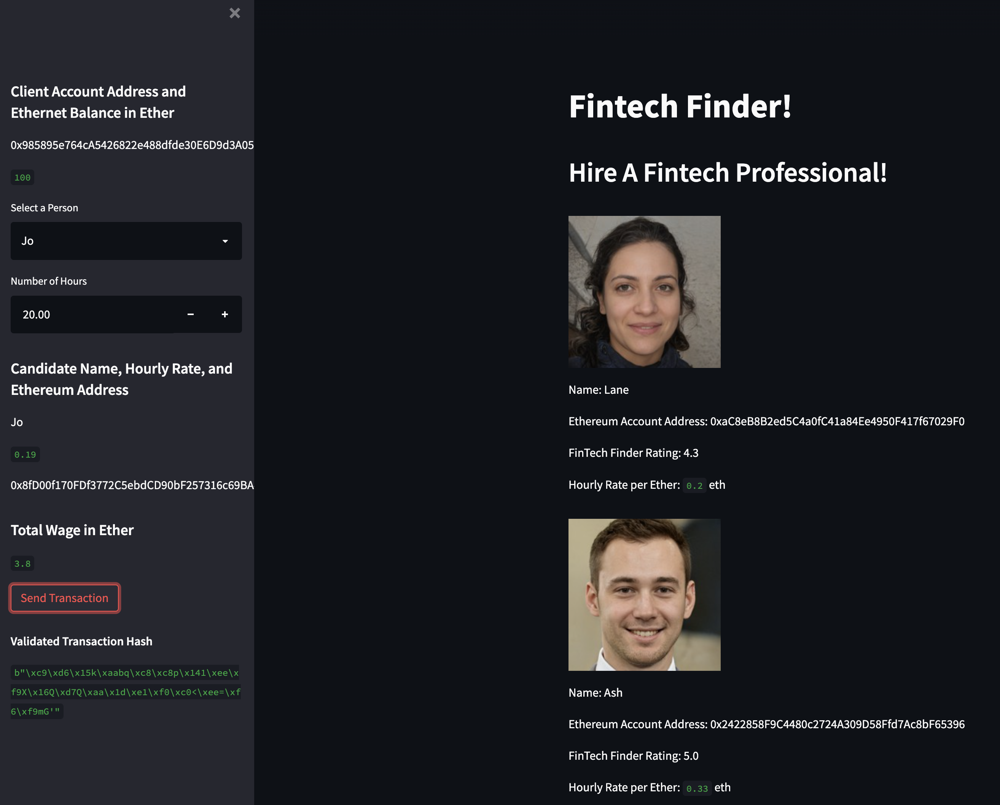
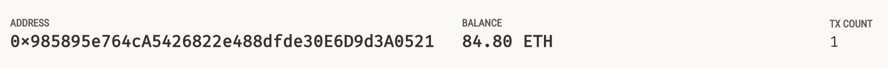
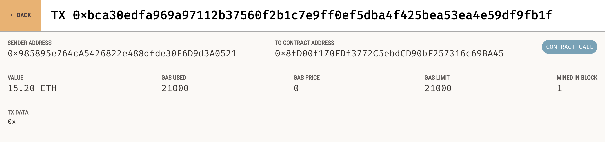

# Fintech Freelancer Marketplace

This project builds a proof-of-concept marketplace that lists fintech freelancers and allows the hiring party to pay the freelance in Ether within the marketplace.  

<br>

## Technologies

This project leverages python 3.7 with the following packages:  

* [bip44](https://pypi.org/project/bip44/) - For python implementation of Bitcoin Improvement Proposal 44
* [dotenv](https://pypi.org/project/python-dotenv/) - For setting environment variables
* [Streamlit](https://streamlit.io/) - For rapidly building frontends for data-driven apps
* [Web3.py](https://web3py.readthedocs.io/en/stable/index.html) - For interacting with Ethereum using python  

<br>

## Installation Guide

Before running the application first install the following dependencies.

```python
 pip install bip44
 pip install python-dotenv
 pip install streamlit
 pip install web3==5.17
```

[Ganache](https://trufflesuite.com/ganache/) is used for testing and confirming transaction. If using Ganache for testing, paste the mnemonic in the `.env` file in the same directory as `fintech_finder.py`. Within `.env` set the mnemonic as the variable `MNEMONIC`.

<br>

## Usage

To use the app clone the repository and run the following command in the directory where `fintech_finder.py` is located:

```python
 streamlit run fintech_finder.py
```

To hire a fintech freelancer select the person being hired from the __Select a Person__ dropdown. Enter the number hours for which the person is being hired. Click the __Send Transaction__ button to pay the person in Ether. If the transaction is successful the transactions hash will appear below __Validated Transaction Hash__.



If using Ganache, the change in the balance of Ether can be viewed from the __ACCOUNTS__ tab. Look for the account with the address that matches the one displayed under __Client Account Address and Ethernet Balance in Ether__ in the marketplace app. The details of the transaction can be viewed selecting the __TRANSACTION__ tab in Ganache and clicking the transaction.

__Account Summary__
  

__Transaction Summary__


<br>

## Contributors

Josh Mischung: [josh@knoasis.io](josh@knoasis.io), [LinkedIn](https://www.linkedin.com/in/joshmischung/)

<br>

## License

MIT License

Copyright (c) [2022] [Joshua Mischung]

Permission is hereby granted, free of charge, to any person obtaining a copy
of this software and associated documentation files (the "Software"), to deal
in the Software without restriction, including without limitation the rights
to use, copy, modify, merge, publish, distribute, sublicense, and/or sell
copies of the Software, and to permit persons to whom the Software is
furnished to do so, subject to the following conditions:

The above copyright notice and this permission notice shall be included in all
copies or substantial portions of the Software.

THE SOFTWARE IS PROVIDED "AS IS", WITHOUT WARRANTY OF ANY KIND, EXPRESS OR
IMPLIED, INCLUDING BUT NOT LIMITED TO THE WARRANTIES OF MERCHANTABILITY,
FITNESS FOR A PARTICULAR PURPOSE AND NONINFRINGEMENT. IN NO EVENT SHALL THE
AUTHORS OR COPYRIGHT HOLDERS BE LIABLE FOR ANY CLAIM, DAMAGES OR OTHER
LIABILITY, WHETHER IN AN ACTION OF CONTRACT, TORT OR OTHERWISE, ARISING FROM,
OUT OF OR IN CONNECTION WITH THE SOFTWARE OR THE USE OR OTHER DEALINGS IN THE
SOFTWARE.
